## Introducción

Entre 1936 y 1950, se estima que 20.000 a 25.000 refugiados de la guerra civil española entraron a Mexico[@num_refugiados]. La familia de José Banegas Gil cuenta en esta cifra.

Lo que sigue es una serie de fuentes primarias publicadas. En las notas al pie, se pueden encontrar los enlaces a los fuentes primerias publicadas.

## Información Básica

José Banegas Gil nació el 27 de diciembre 1900 en Archena, Murcia, en la region de Murcia en España. Su esposa, Isabel Rubio Redondo, naciò el 24 de abril 1908 en Linares, Jaén en la region de Andalusia en España.\

```{r}
#| layout-ncol: 2
#| out-height: 400px

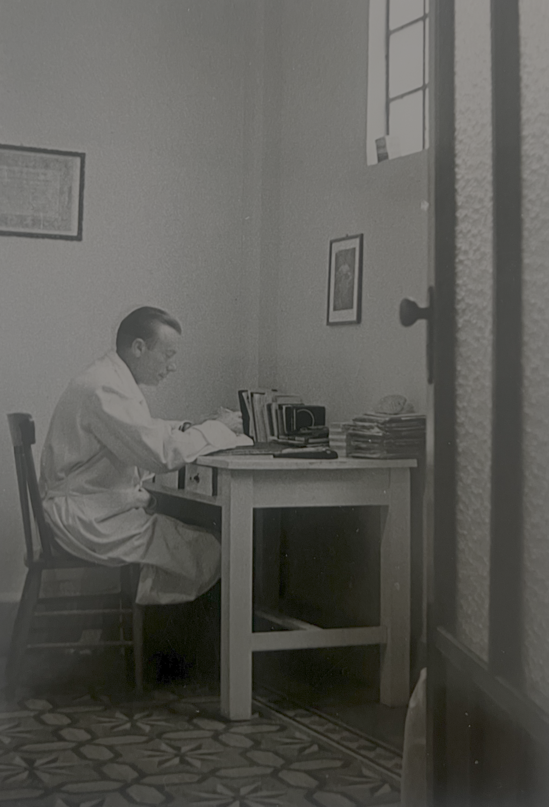
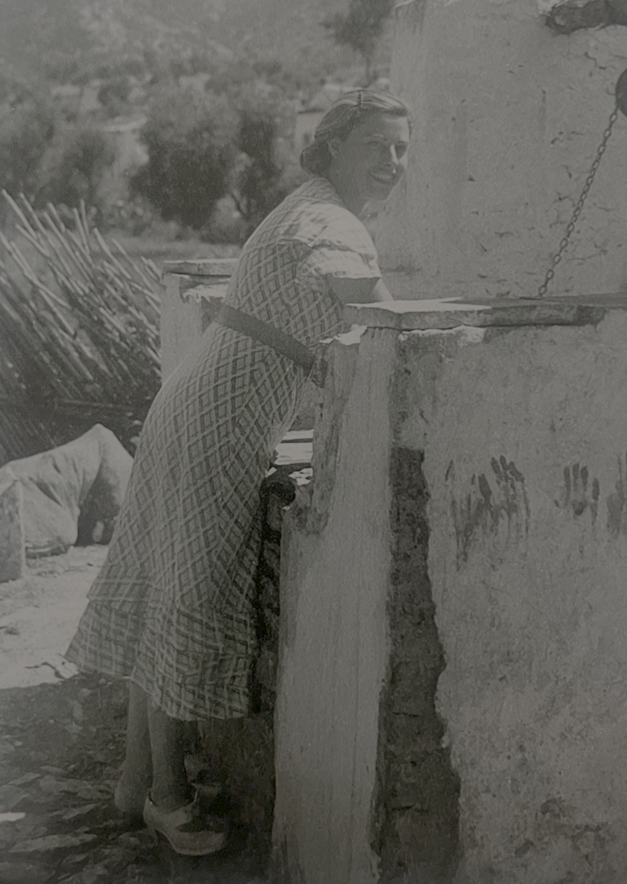
```

```{r}

library(leaflet)

places <- data.frame(
  name = c(
    "Archena",
    "Linares"
  ),
  lat = c(
    38.1167,
    38.0952
  ),
  lon = c(
    -1.3000,
    -3.6360
  )
)

leaflet::leaflet(places) |>
  leaflet::addTiles() |>
  leaflet::addCircleMarkers(
    lng = ~lon,
    lat = ~lat,
    radius = 7,
    fillOpacity = 1,
    popup = ~name
  ) |>
  leaflet::addLabelOnlyMarkers(
    lng = ~lon,
    lat = ~lat,
    label = ~name,
    labelOptions = leaflet::labelOptions(
      noHide = TRUE,
      direction = "bottom",
      offset = c(0, 8),
      textOnly = TRUE,
      style = list(
        "font-size" = "14px",
        "font-weight" = "bold"
      )
    )
  ) |>
  leaflet::setView(
    lng = -3.5,
    lat = 39.5,
    zoom = 6
  ) |>
  leaflet::addEasyButton(
    leaflet::easyButton(
      icon = "fa-home",
      title = "Home",
      onClick = htmlwidgets::JS(
        "function(btn, map){
          map.setView([39.5, -3.5], 6);
        }"
      )
    )
  )
```

## Juventud de José

Entre 1912 y 1918, José asistió el Instituto General y Tecnico de Murcia[@expediente_academico]. Sigue al enlace en la nota al pie para ver su expediente académico que incluye su applicacion de 1912, información sobre sus papás, examen de ingreso, y todas de sus califaciónes.

```{r}

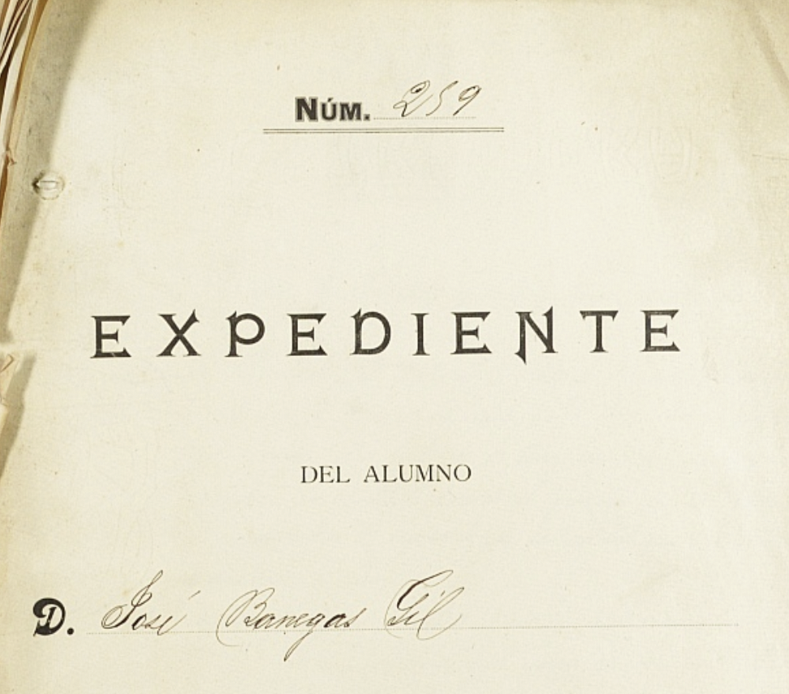
```

En la Gaceta de Madrid en 1922 José fue nombrado como reclutado al ejercito en el 1921[@1922_reclutado].

```{r}

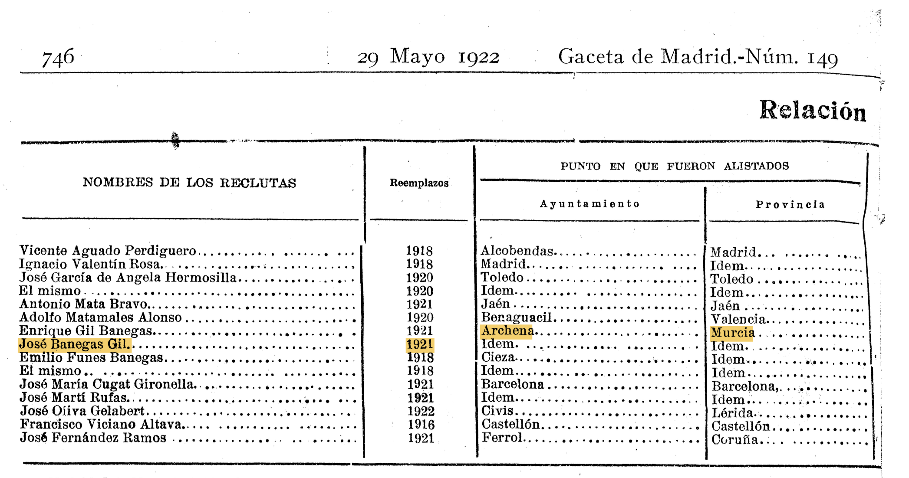
```

En 1927 José aparece en una lista en la Gaceta de Madrid de doctores que han aprobado el examen para ingresarse al Cuerpo de Inspectores m unicipales de Sanidad[@1927_doctor].

```{r}

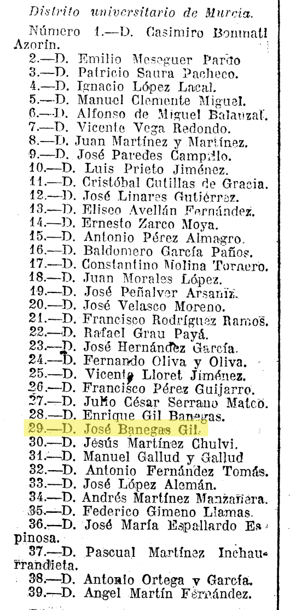
```

## España en Crisis

PARRAFO DE BACKGROUND INFO Para los años 30, España habia llegado a un periodo de crisis[@guerra_civil]. ADD MORE.

Law of Political Responsibilities - 9 Feb 1939 \[explain and find source\]

Más tarde en el mismo mes, el Boletín Official de Ceuta anuncia que José fue emplazado por la Comisíon de Incautación de Bienes de la Plaza de Ceuta por su "oposición y actividades contrarias al Glorioso Movimiento Nacional"[@1939_boletin].

```{r}

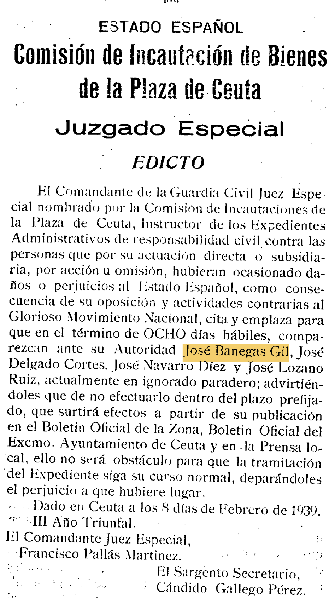
```

Cinco semanas después, las Nacionalistas entrarón a Madrid y Franco declararía victoria en el 1 de april, 1939 y empezó la dictadura Franquista que duró hasta su muerte en 1975[@guerra_civil].

## Solicitando Asilo Político

Justo el dia siguente en el 2 de abril, 1939, José escribe cartas de Casablanca al consulado Mexicano en Francia solicitando asilo politico para él y su esposa y tres hijos. Por medio de estas cartas, aprendemos más sobre la vida de José en sus propias palabras.

En la primera carta, José escribió que...[@carta_exilio1].

```{r}

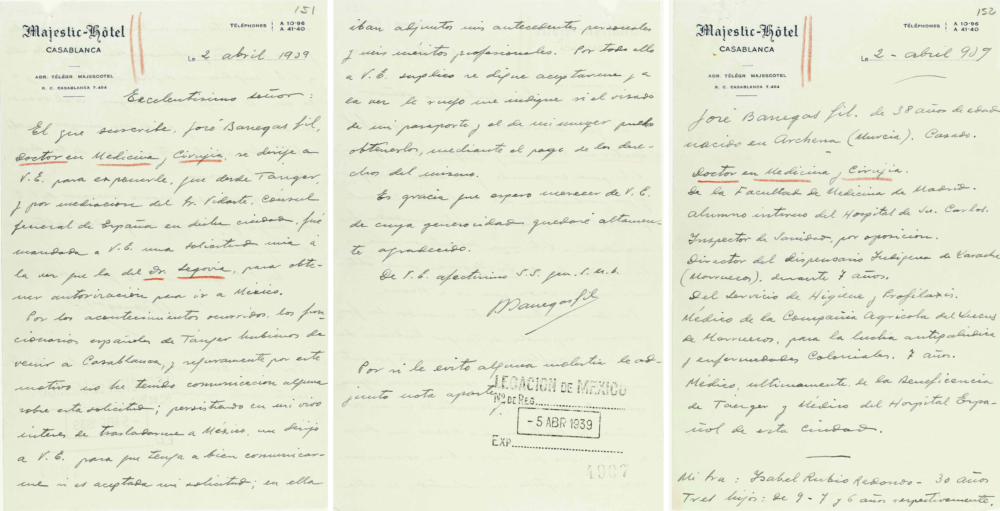
```

En la segunda carta, José escribió que desde 1928 trabajó como director del dispensario sifelina?? de Larache, Marruecos. El 20 de julio 1936, se mudó a la zona Francesa en Tanger (tres días después del inicio de la guerra civil). En la segunda pagina, dice que su deseo es ir Mexico o Venezuela[@carta_exilio2].

```{r}

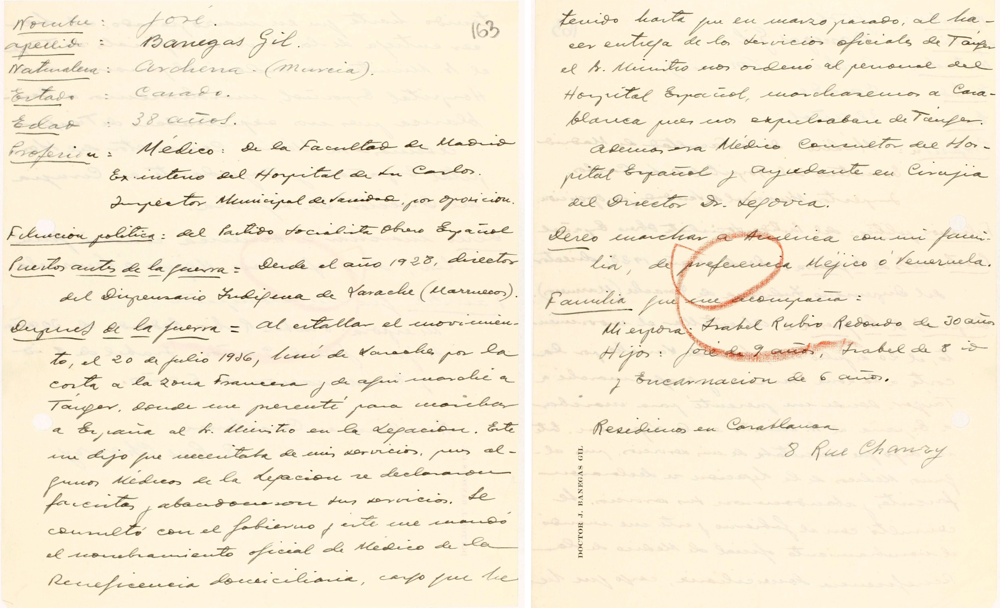
```

## Escapando a Mexico

Desafortunadamente, no hay un record publicado sobre lo que pasó entre 1939 y 1941.

Sin embargo, los nombres de José, Isabel, y sus tres hijos aparecen en una lista de pasajeros de barcos que llegaron a San Juan, Puerto Rico en el 18 de febrero en 1941. Habían viajado por un barco de vapor que había salido de La Guiara, Venezuela. El record dice que la ultima residencia de la familia fue Santos, Brazil[@PR_passengerlist].

```{r}

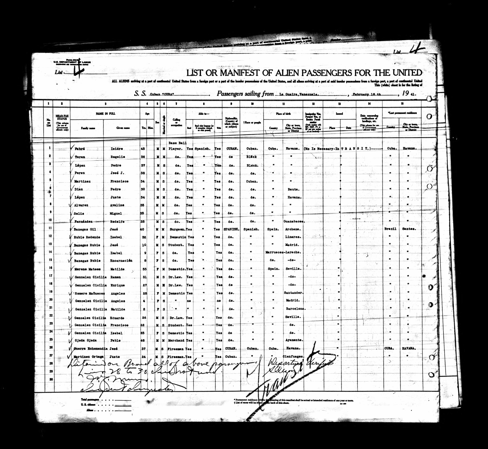
```

En el 9 de marzo 1941, la familiia entraron a Mexico por la puerta de Veracruz en un barco de vapor que se llamaba Monterrey que habia salida la isla de Cuba.

```{r}

places <- data.frame(
  name = c(
    "Tangier, Morocco",
    "San Juan, Puerto Rico",
    "Brazil",
    "Veracruz, Mexico"
  ),
  lat = c(
    35.7595,
    18.4655,
    -10.0,
    19.1738
  ),
  lon = c(
    -5.8340,
    -66.1057,
    -45.0,
    -96.1342
  )
)

leaflet::leaflet(places) |>
  leaflet::addTiles() |>
  
  # Tangier → San Juan
  leaflet::addPolylines(
    lng = c(places$lon[1], places$lon[2]),
    lat = c(places$lat[1], places$lat[2]),
    weight = 3
  ) |>
  
  # San Juan → Brazil
  leaflet::addPolylines(
    lng = c(places$lon[2], places$lon[3]),
    lat = c(places$lat[2], places$lat[3]),
    weight = 3
  ) |>
  
  # Brazil → Veracruz
  leaflet::addPolylines(
    lng = c(places$lon[3], places$lon[4]),
    lat = c(places$lat[3], places$lat[4]),
    weight = 3
  ) |>
  
  leaflet::addCircleMarkers(
    lng = ~lon,
    lat = ~lat,
    radius = 7,
    popup = ~name,
    fillOpacity = 1
  )
```

## Entrando Mexico

Aqui son los documentos para entrar Mexico. Add link to Jose's card: https://pares.cultura.gob.es/MovimientosMigratorios/viewer2Controller.form?nid=7892&accion=4&pila=true

```{r}

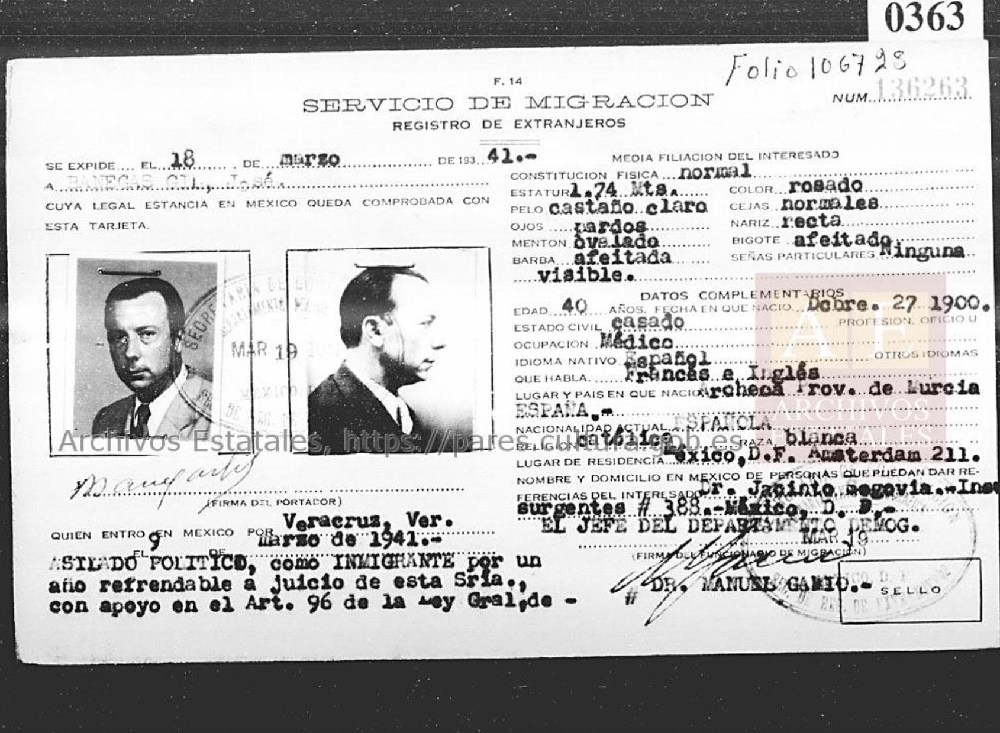

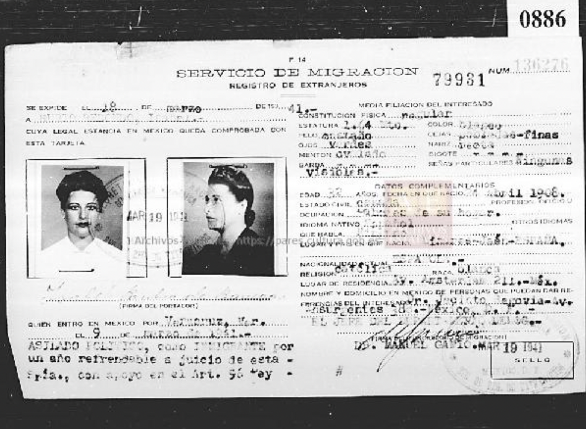
```

## José sigue aparaciendo en las noticias

As his whereabouts were still unknown, José's name would continue to appear in the newspaper in Spain.

- Feb 1943

- Nov 1943

- 21 de febrero 1946

## José en Puebla, Mexico

- pic of José with other doctors

## Recuerdos de la familia
