## Introducción

Entre 1936 y 1950, se estima que entre 20,000 a 25,000 refugiados de la guerra civil española entraron a Mexico[@num_refugiados]. La familia de José Banegas Gil cuenta en esta cifra.

Lo que sigue es una serie de fuentes primarias publicadas. En las notas al pie, se pueden encontrar los enlaces a las fuentes primarias publicadas.

## Información Básica

José Banegas Gil nació el 27 de diciembre1900 en Archena, Murcia, en la región de Murcia en España. Su esposa, Isabel Rubio Redondo, naciò el 24 de abril 1908 en Linares, Jaén en la región de Andalucía en España.\

```{r}
#| layout-ncol: 2
#| out-height: 400px

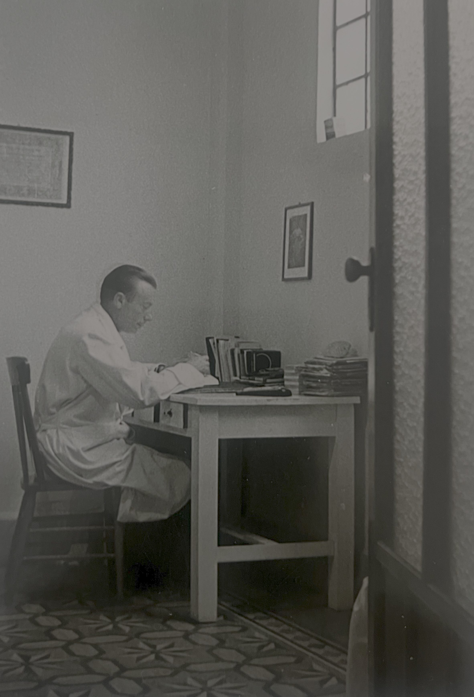
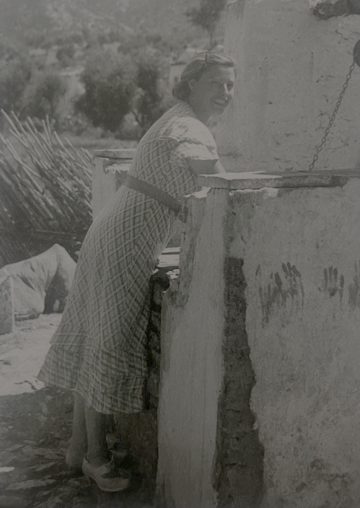
```

```{r}

library(leaflet)

places <- data.frame(
  name = c(
    "Archena",
    "Linares"
  ),
  lat = c(
    38.1167,
    38.0952
  ),
  lon = c(
    -1.3000,
    -3.6360
  ),
  popup = c(
    "José Banegas Gil. Nacido: 1900.",
    "Isabel Rubio Redondo. Nacida: 1908."
  )
)

leaflet::leaflet(places) |>
  leaflet::addTiles() |>
  leaflet::addCircleMarkers(
    lng = ~lon,
    lat = ~lat,
    radius = 7,
    fillOpacity = 1,
    popup = ~popup
  ) |>
  leaflet::addLabelOnlyMarkers(
    lng = ~lon,
    lat = ~lat,
    label = ~name,
    labelOptions = leaflet::labelOptions(
      noHide = TRUE,
      direction = "bottom",
      offset = c(0, 8),
      textOnly = TRUE,
      style = list(
        "font-size" = "14px",
        "font-weight" = "bold"
      )
    )
  ) |>
  leaflet::setView(
    lng = -3.5,
    lat = 39.5,
    zoom = 6
  ) |>
  leaflet::addEasyButton(
    leaflet::easyButton(
      icon = "fa-home",
      title = "Home",
      onClick = htmlwidgets::JS(
        "function(btn, map){
          map.setView([39.5, -3.5], 6);
        }"
      )
    )
  )
```

## La Etapa de La Juventud de José

Entre 1912 y 1918, José asistió al Instituto General y Técnico de Murcia[@expediente_academico]. Consulta el enlace en la nota al pie para ver su expediente académico que incluye: su applicación de 1912, la información sobre sus papás, el examen de ingreso, y todas sus califaciones. En las páginas 3 y 4 del expediente académico de José, aparecen los nombres de sus papás: Andrés Banegas Rodríguez y Lucrecia Gil. Los nombres de sus abuelos paternos fueron: Andrés Banegas Martínez y Encarnación Rodríguez Luna. Los nombres de sus abuelos maternos fueron: Onofre Gil Marco y Josefa Prieto.

```{r}

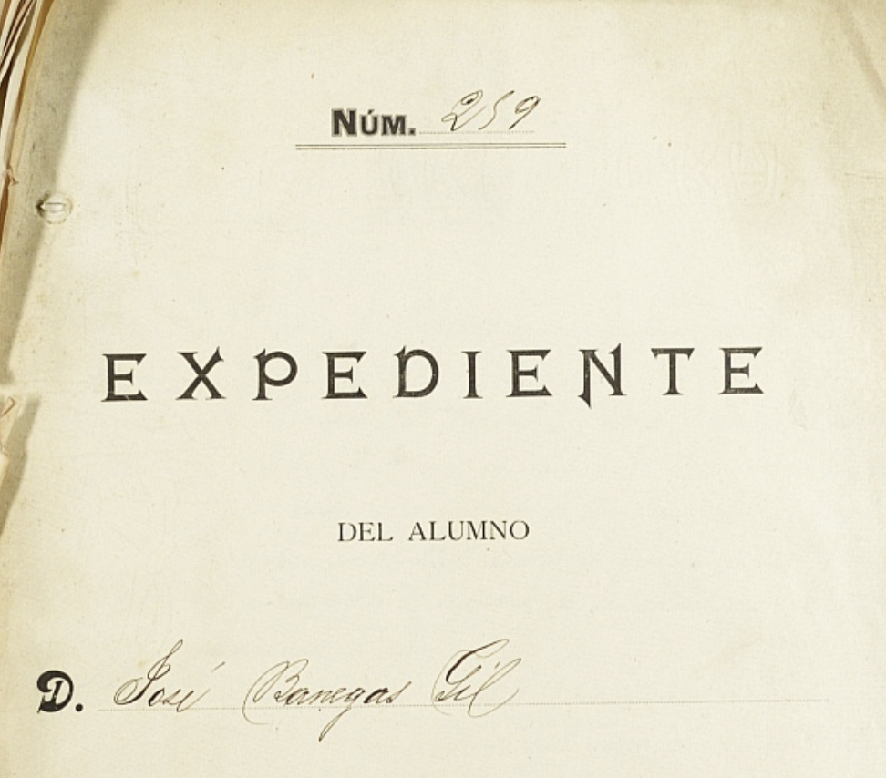
```

En la Gaceta de Madrid en 1922, José fue reclutado al ejército en el 1921[@1922_reclutado].

```{r}

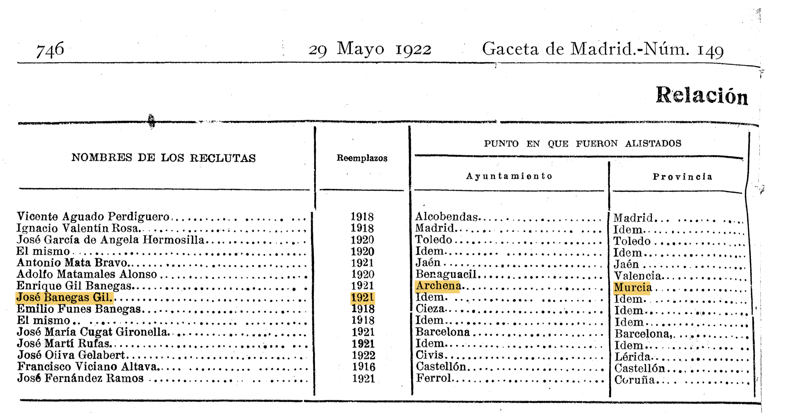
```

En 1927, José aparece en una lista en la Gaceta de Madrid de doctores que aprobaron el examen para ingresar al Cuerpo de Inspectores Municipales de Sanidad[@1927_doctor].

```{r}

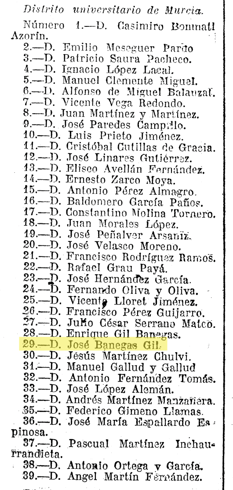
```

## España en Crisis

Para los años 30, España había llegado a un periodo en crisis. Se convocaron elecciones en 1931, después de haber pasado por una dictadura del general Primo de Rivera. El general había perdido el apoyo del militar y del rey Alfonso XIII debido a la presión de varios grupos. Entre ellos se encontraban las elites intelectuales, grupos obreros, partidarios republicanos, estudiantes universitarios y militantes de izquierda. Las elecciones dieron lugar a la proclamación de la Segunda República Española y la abdicación del rey Alfonso XIII. Era una época de reforma social y al mismo tiempo de golpes de estado y huelgas.

Más tarde en las elecciones de 1936, ganó una coalición de izquierda, llamada el Frente Popular, que consistió del Partido Socialista Obrero Español, sectores anarquistas, sindicalistas y comunistas, campesinos, y movimientos autónomos. Debido a todas las reformas sociales de los republicanos, surgió una oposición nacionalista que consistió de grupos monárquicos, terratenientes, conservadores, la Iglesia Católica, la alta burguesía, y el alto mando militar.

La guerra civil Española estalló el 17 de julio de 1936 con una insurreción militar encabezada por el general Francisco Franco en la ciudad de Melilla[@guerra_civil].

## La Represión Franquista

Tres años después, llegando al fin de la guerra, los nacionalistas habían controlado casí todo el país. En el 9 de febrero de 1939, Franco firmó la Ley de Responsibilidades Políticas. Esta ley prohibió participación en partidos y grupos considerados opuestos al Movimento Nacional[@Andalan].

En el mismo mes, el Boletín Oficial de Ceuta anunció que José fue citado a comparecer por la Comisión de Incautación de Bienes de la Plaza de Ceuta por su "oposición y actividades contrarias al Glorioso Movimiento Nacional"[@1939_boletin].

```{r}

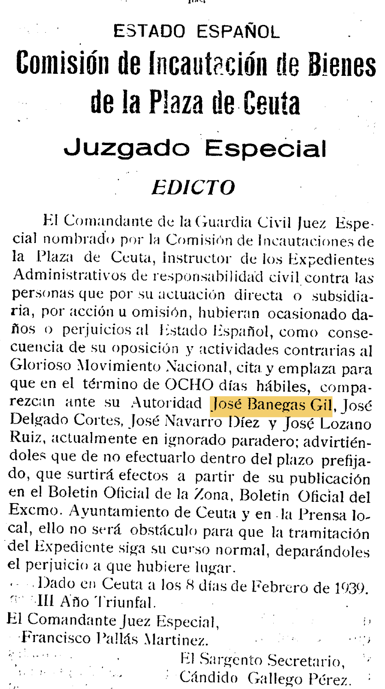
```

Cinco semanas después, los nacionalistas entraron a Madrid, y en ese entonces, Franco declararía victoria el 1 de abril 1939 y así empezó la dictadura Franquista que duró hasta su muerte en 1975[@guerra_civil].

Resulta que José fue miembro de dos grupos ya ilegales en esa fecha, según la Ley de Responsabilidades Políticas, entre ellas: El Partido Socialista Obrero Español (PSOE) y La Unión General de Trabajadores (UGT). A continuación, tenemos el registros publicado y sus propias palabras.

Primero, José fue nombrado en una lista de los refugiados españoles residentes en Marruecos, a quienes se documentó como inmigrantes aceptados por el legado de México[@pso_174, p. 427]. Dice que su filiación politica fue PSO.

```{r}

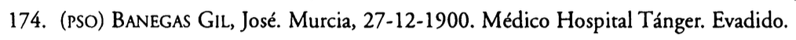
```

Segundo, en su expediente como refugiado en México, José se identifica como parte del PSOE y UGT en Tánger[@expediente_ref].

```{r}

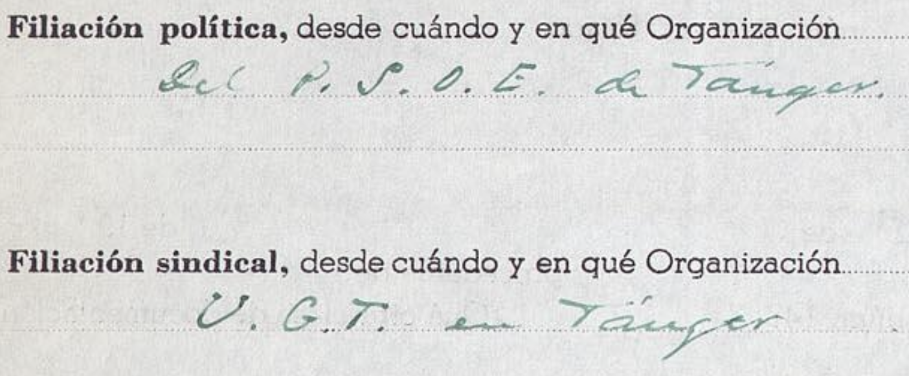
```

## Solicitando Asilo Político

En el 2 de abril 1939, el día después del fin de la guerra civil, José escribió cartas desde Casablanca al consulado Mexicano en Francia, solicitando asilo político para él y su esposa, Isabel, y tres hijos: José, Isabel, y Encarnación. Por medio de estas cartas, aprendemos más sobre la vida de José en sus propias palabras.

En la primera carta, José escribió que tuvo que huir de Tánger para Casablanca. Era un doctor de medicina y cirugía que había trabajado en varios hospitales. En esta epoca José tenia 38 años y Isabel 30 años[@carta_exilio1].

```{r}

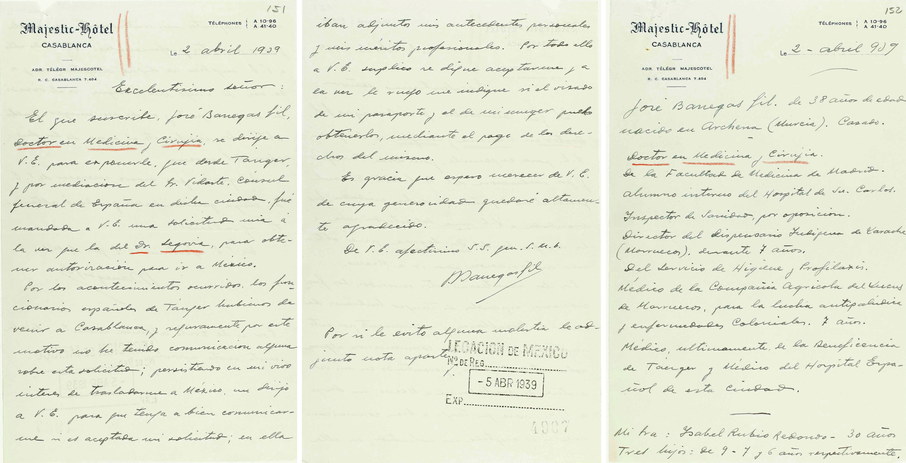
```

En la segunda carta, José escribió que desde 1928 trabajó como director del Dispensario Indígena de Larache, Marruecos. El 20 de julio 1936, se mudó a la zona Francesa en Tánger (tres días después del inicio de la guerra civil). En la segunda página, dice que su deseo es ir a México o Venezuela. Las edades de sus hijos son las siguientes: José (9), Isabel (8), y Encarnación (6)[@carta_exilio2].

```{r}

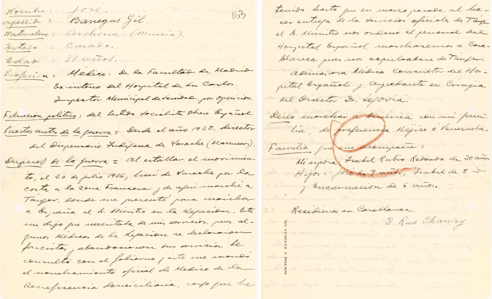
```

## Escapando a México

Desafortunadamente, no hay un registro publicado sobre cómo salió la familia de Marruecos.

Sin embargo, los nombres de José, Isabel, y sus tres hijos aparecen en una lista de pasajeros de barcos que llegaron a San Juan, Puerto Rico el 18 de febrero 1941. Habían viajado por un barco de vapor que había salido de La Guaira, Venezuela. Además, el registro dice que la ultima residencia de la familia fue Santos, Brazil[@PR_passengerlist].

```{r}

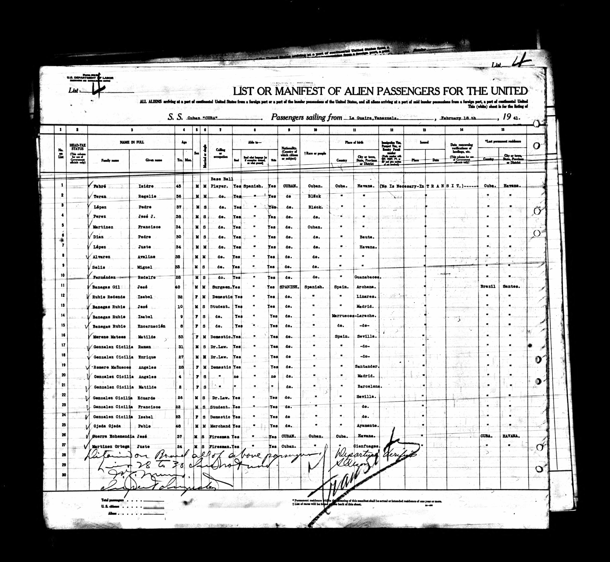
```

A continuación, en el 9 de marzo 1941, la familiia entró a México por el puerto de Veracruz en un barco de vapor que se llamaba Monterrey, que había salido de Habana, Cuba[@expediente_ref, p. 6].

```{r}

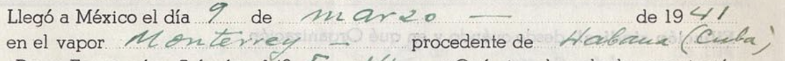
```

Asimismo, el registro de La Junta de Auxilio de Los Republicanos Españoles (JARE) describe que ellos pagaron el viaje de Cuba a México[@JUNTA].

```{r}

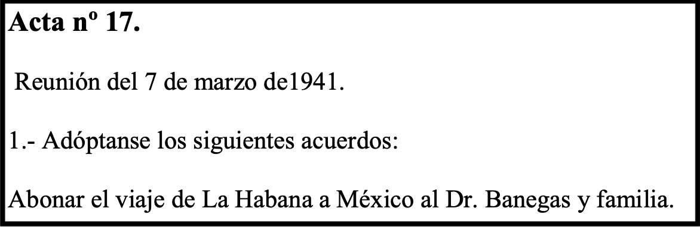
```

Desafortunadamente, no tenemos todo el récord publicado del viaje, no obstante, podemos asumir que la familia escapó Marruecos en 1939 llegando a los siguientes destinos: Santos, Brazil -\> La Guaira, Venezuela -\> San Juan, Puerto Rico -\> Habana, Cuba -\> y finalmente llegó a Veracruz, México en 1941.

```{r}

places <- data.frame(
  name = c(
    "Casablanca, Morocco",
    "Santos, Brazil",
    "La Guaira, Venezuela",
    "San Juan, Puerto Rico",
    "Habana, Cuba",
    "Veracruz, Mexico"
  ),
  lat = c(
    33.5731,
    -23.9609,
    10.5990,
    18.4655,
    23.1136,
    19.1738
  ),
  lon = c(
    -7.5898,
    -46.3166,
    -66.9286,
    -66.1057,
    -82.3666,
    -96.1342
  )
)

# Initial map view
home_lng <- -55
home_lat <- 8
home_zoom <- 2

leaflet::leaflet(places) |>
  leaflet::addTiles() |>
  
  # Set initial view
  leaflet::setView(
    lng = home_lng,
    lat = home_lat,
    zoom = home_zoom
  ) |>
  
  # Casablanca → Santos
  leaflet::addPolylines(
    lng = c(places$lon[1], places$lon[2]),
    lat = c(places$lat[1], places$lat[2]),
    weight = 3
  ) |>
  
  # Santos → La Guaira
  leaflet::addPolylines(
    lng = c(places$lon[2], places$lon[3]),
    lat = c(places$lat[2], places$lat[3]),
    weight = 3
  ) |>
  
  # La Guaira → San Juan
  leaflet::addPolylines(
    lng = c(places$lon[3], places$lon[4]),
    lat = c(places$lat[3], places$lat[4]),
    weight = 3
  ) |>
  
  # San Juan → Habana
  leaflet::addPolylines(
    lng = c(places$lon[4], places$lon[5]),
    lat = c(places$lat[4], places$lat[5]),
    weight = 3
  ) |>
  
  # Habana → Veracruz
  leaflet::addPolylines(
    lng = c(places$lon[5], places$lon[6]),
    lat = c(places$lat[5], places$lat[6]),
    weight = 3
  ) |>
  
  leaflet::addCircleMarkers(
    lng = ~lon,
    lat = ~lat,
    radius = 7,
    popup = ~name,
    fillOpacity = 1
  ) |>
  
  # Home button
  leaflet::addEasyButton(
    leaflet::easyButton(
      icon = "fa-home",
      title = "Home",
      onClick = htmlwidgets::JS(
        "function(btn, map){
          map.setView([8, -55], 2);
        }"
      )
    )
  )
```

## Entrando a México

Aquí se presentan los documentos de inmigración para entrar a México[@JBG_immig_doc; @IRR_immig_doc]. El documento dice que su primer lugar de residencia fue en 211 Amsterdam en la Ciudad de México.

```{r}

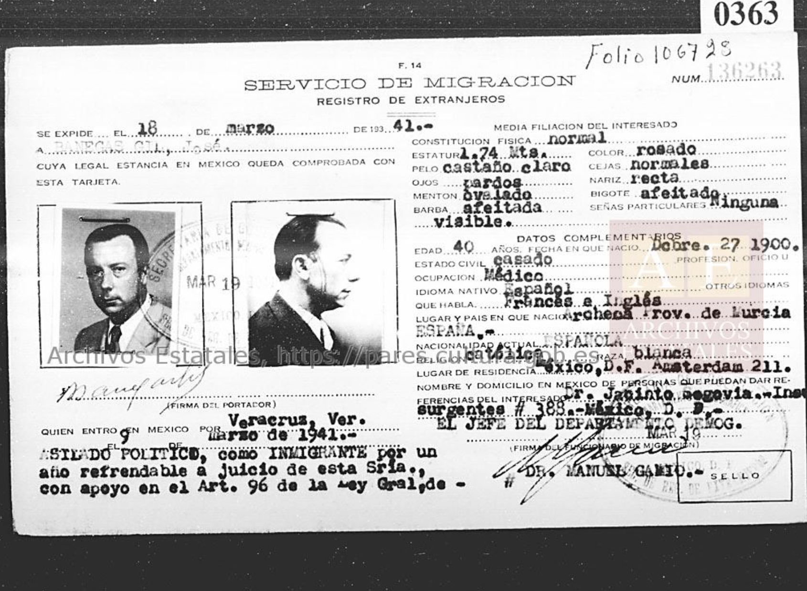

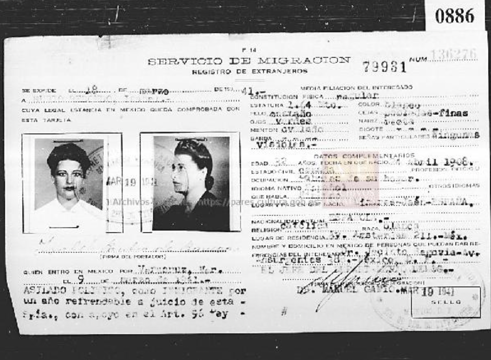
```

Asimismo, tenemos el registro de correspondencia entre José y la Junta de Auxilio a Los Republicanos Españoles (JARE)[@expediente_ref].

Consulta el enlace en la nota al pie para ver el expediente. Nota: Haz click en 'more pages' para ver todas las 31 páginas del expediente. Para leer los documentos cronológicamente, se debe leer de la última página hasta la primera.

Abajo se encuentra la primera carta que José escribió a la JARE. Con esta carta se puede entender como José y la familia habían luchado en las primeras semanas en México como refugiados.

```{r}

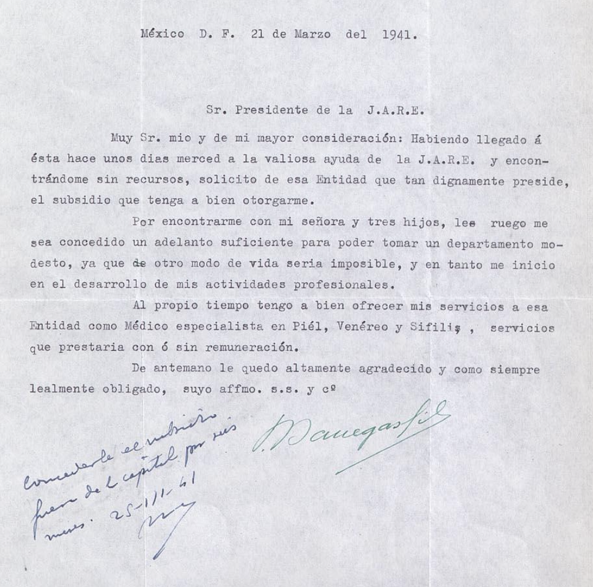
```

Al final, la JARE le otorga a José y su familia un subsidio de seis meses fuera del la capital para mudarse a Puebla, Puebla el 22 de mayo 1941[@expediente_ref].

## José en las Noticias en España

Como su paradero era desconocido por el gobierno de España, el nombre de José aparece hastá 1946 en las noticias Españolas.

En el 12 de febrero 1943, el Boletín Oficial Del Estado José fue nombrado como parte de un grupo que fue citado a comparecer en diez días por el Tribunal Especial para la Represión de la Masonería y del Comunismo, y que habría consequencías legales si no aparecen antes el juez. [@Feb12_1943].

```{r}

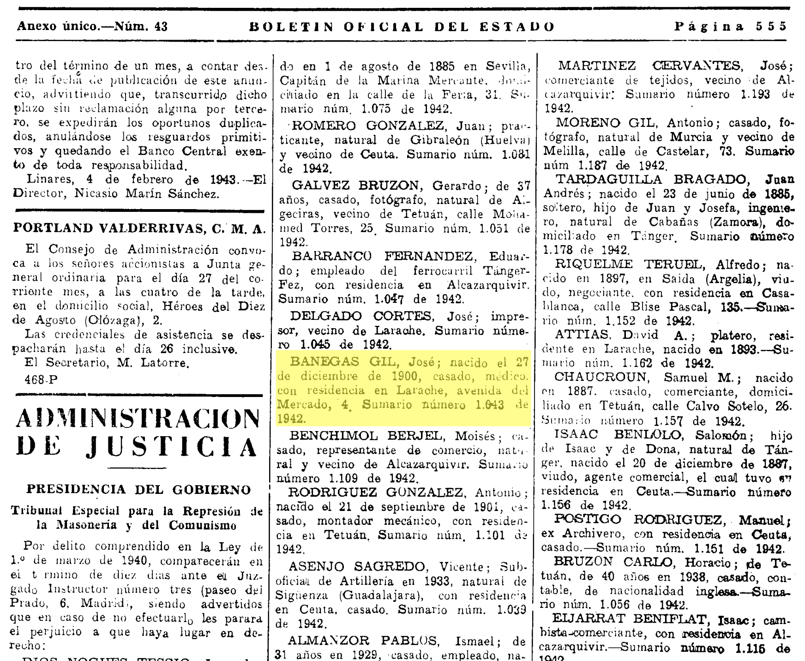
```

Más tarde en el 17 de noviembre 1943, el Boletin Oficial Del Estado narra que José fue condenado 'como autor de un delito consumado de Masonería' y se declara la orden de 'la busca, captura y prisión del condenado'[@Nov17_1943].

```{r}

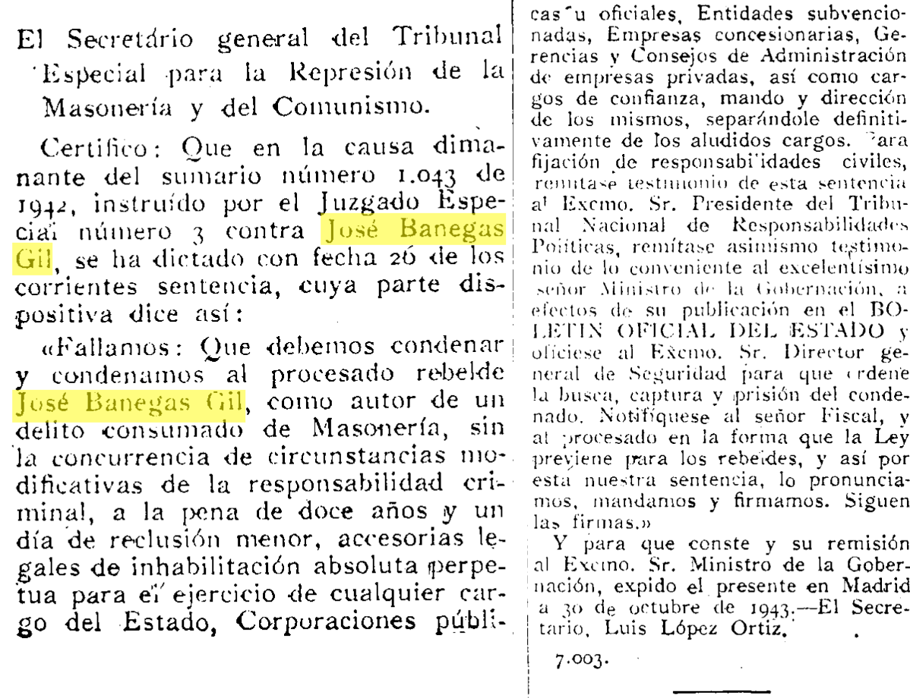
```

A partir de 1945, el Tribunal Nacional de Responsabilidades Políticas fue reemplazado por la Comisión Liquidadora de Responsabilidades Políticas. En el 21 de febrero 1946 en el Boletín Oficial de Ceuta, se dice que José puede recobrar sus bienes. Podemos asumir que José nunca recibió el mensaje[@1946_ceuta].

```{r}

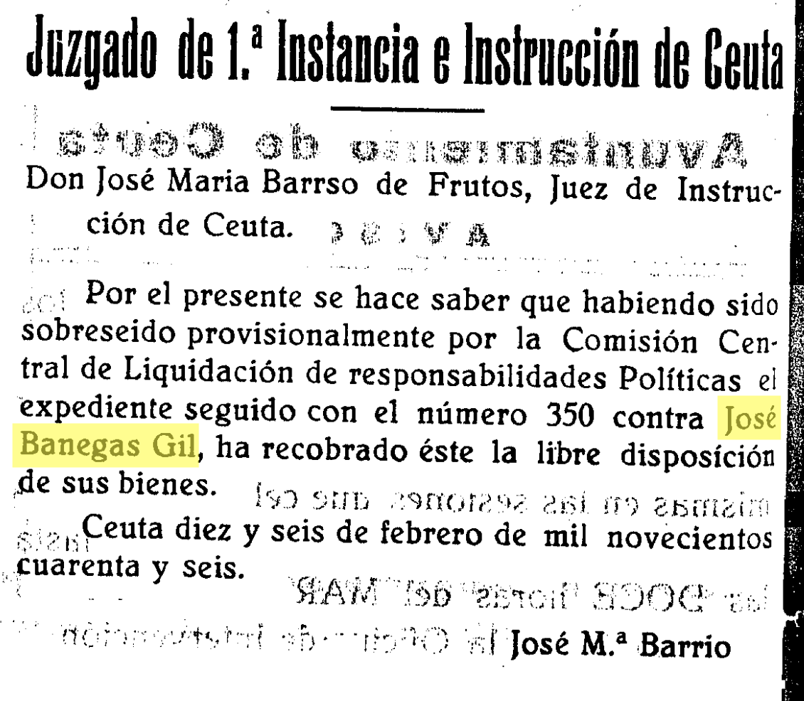
```

## José en Puebla, México

El único registro de José que se tiene en Puebla, es la siguiente foto en frente del Sanatorio Español de Puebla en 1955[@PUEBLA]. Tenemos que asumir que José es la persona que aparece en la primera fila, el segundo de derecha a izquierda.

```{r}

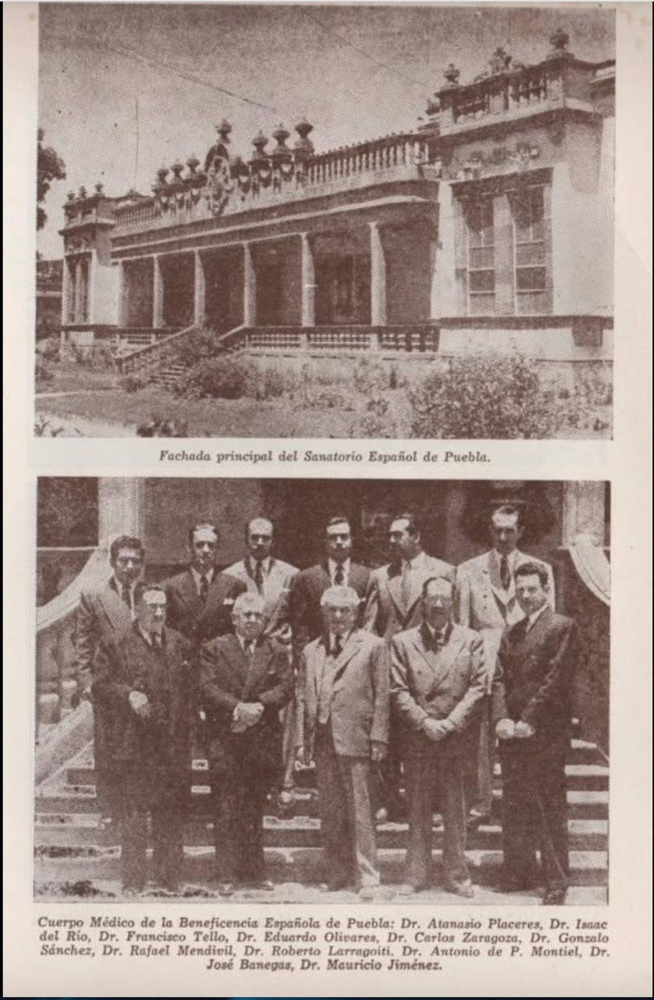
```

Este proyecto fue hecho por Alex Balcázar con amor para todos los descendientes de José y Isabel y sus tres hijos: José, Isabel, y Encarnación.
